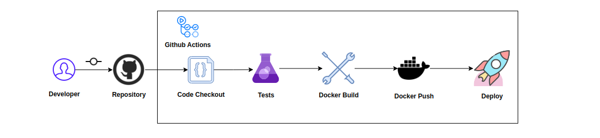

# First Step in End to End Machine learning 

## Architecture Diagram

## CICD
🔧 **CI/CD pipeline using GitHub Actions**

- Triggered on push to main, excluding README.md.
- Two jobs: integration and build-push-package.

1. **integration:**
- Matrix: Python 3.9, 3.10, 3.11.
- Setup Python, install deps.
- Lint code using ruff.

2. **build-push-package:**
- Depends on integration.
- Build Docker image, push to Docker Hub.